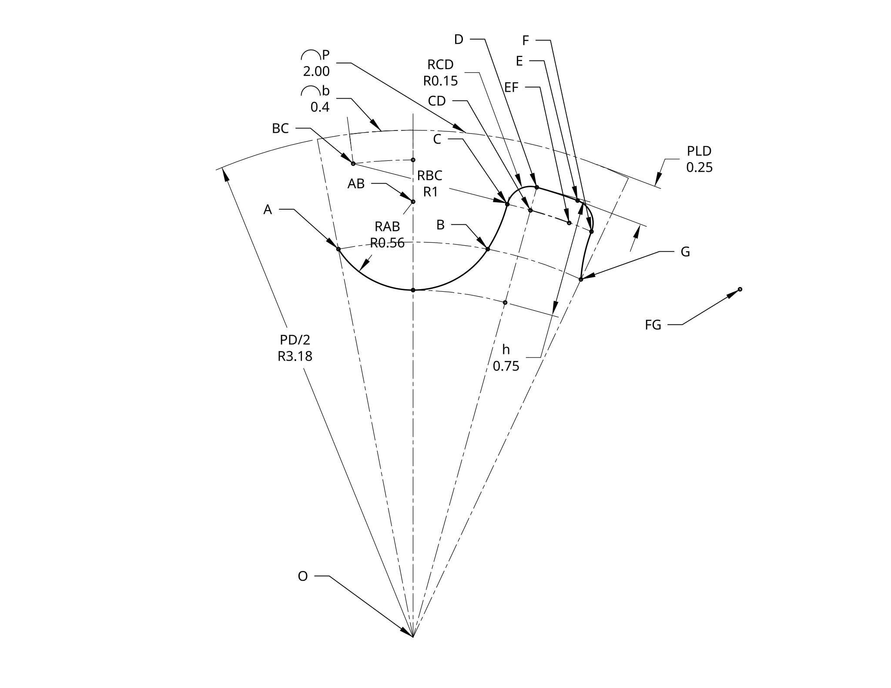

# pulley_analytical_solutions

This solves for the GT-2 and GT-3 pulley tooth profile analytically
using sympy. The variables and pararmeters named in [pulley_eqns.ipynb](pulley_eqns.ipynb) are referenced in the diagram below. The parameters are RAB, RBC, RCD, d, h, P, and PD. All of the other named values are variables. The origin is at O.

Solving for all variables at once doesn't tend to converge quickly (it simply never solved when I tried it, perhaps you have more patience than me, but I suspect it may take longer than your computer will last to solve),
so the solution is approached in multiple steps.

1. Solve for AX, AY, BX, BY, ABX, ABY, BCX, and BCY.
2. Solve for CDX, CDY, then use that solution to compute CX, CY, DX, and DY
3. Solve for EFX, EFY, EX, EY, FX, FY, GX, GY, FGX, FGY by reflecting their corresponding points across the angle bisector of $\angle BOG$

The final solution set isn't a "pure" solution, where all of the variables are solved for in terms of the parameters. Rather, the variable solutions are in order, where each can depend on the parameters and results from previous solutions. This allows for the result to be much more compact, and computed more efficiently.
